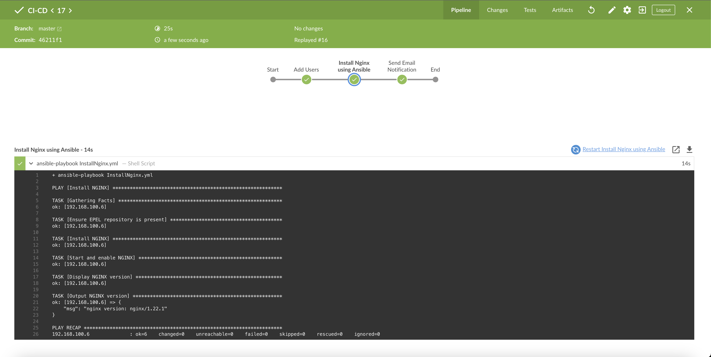

# Jenkins Server Configuration

### Create a New Multibranch Pipeline Item

- Navigate to Jenkins dashboard, select 'New Item', choose 'Multibranch Pipeline', and configure as follows:
  - Under 'Branch Sources', click on 'Add Source' and select 'Git'.
  - Enter the repository URL (e.g., `http://192.168.100.4/gogs/nginx.git`).
  - Click 'Save' to finalize the pipeline configuration.

### Integrate Jenkins with Gogs for Auto-triggering

- **Install Gogs Plugin on Jenkins**.
- **Configure Gogs Server** (Gogs is running inside a Docker container):
  - Pull Gogs image from Docker Hub:
    ```bash
    docker pull gogs/gogs
    ```
  - Create a local directory for Gogs volume:
    ```bash
    sudo mkdir -p /var/gogs
    ```
  - Run Gogs container for the first time:
    ```bash
    docker run --name=gogs -p 10022:22 -p 3000:3000 -v /var/gogs:/data gogs/gogs
    ```
  - To restart the Gogs server:
    ```bash
    docker start -i gogs
    ```
  - Allow localhost hooks by editing `app.ini` inside the container:
    ```bash
    docker exec -it gogs bash
    vi /data/gogs/conf/app.ini
    # Add under [security]: 
    LOCAL_NETWORK_ALLOWLIST=*
    ```
  - Restart Gogs container for changes to take effect.
    ```bash
    sudo docker stop gogs
    sudo docker start -i gogs
    ```

- **Configure Webhooks in Gogs**:
  - Go to the repository settings, navigate to 'Webhooks', and add a new webhook.
  - Set Payload URL as `http://192.168.100.5:8080/gogs/?job=<Pipeline name>` to trigger Jenkins pipelines.

### Configure a Remote Agent on Jenkins

- Go to Jenkins dashboard > Nodes > 'Add new Node'.
- Name the node (e.g., 'vm3') and configure it as a permanent agent.
- Specify the remote root directory and launch method (via SSH):
  - Remote root directory: `/home/vm3/jenkins-agent`
  - Configure SSH with host `192.168.100.6` and use credentials from Jenkins credential manager.

## Ansible Configuration on Jenkins Server (VM1)

### System Update and Package Installation

Update the system and install Ansible using the following commands:

```bash
sudo yum update -y
sudo yum install epel-release -y
sudo yum install ansible
```

### Ansible Hosts and Configuration File Setup

- Navigate to the Ansible configuration directory (`/etc/ansible`) and update the hosts file to include VM3:
  ```bash
  sudo vi hosts
  # Add the following entries
  [vm3]
  192.168.100.6
  [vm3:vars]
  ansible_username=vm3
  ansible_password=######
  ansible_become=yes
  ansible_become_method=sudo
  ansible_become_pass=#########
  ```

- Disable SSH key checking to allow Ansible to connect using only username and password:
  ```bash
  sudo vi ansible.cfg
  host_key_checking=False
  ```

### Verify Connectivity with Ansible

Test the Ansible connection to VM3 using the ping module:
```bash
ansible vm3 -m ping
```
## Jenkins Pipeline Explanation

This Jenkins Pipeline is designed to add users, install Nginx then sends a notification of status using a series of stages, each responsible for a specific part of the process. The pipeline uses an agent that can run on any available executor and specifies stages to add users, install Nginx via Ansible, and send email notifications.

## Pipeline Structure
... (Existing content for Add Users, Install Nginx, Send Email Notification, and Post Actions will be inserted here) ...

```groovy
pipeline {
    agent any

    environment {
        SUDO_PASSWORD = credentials('sudo_password')
    }

    stages {
        stage('Add Users') {
            ...
        }

        stage('Install Nginx using Ansible') {
            ...
        }

        stage('Send Email Notification') {
            ...
        }
    }
    post {
        always {
            echo 'The pipeline has completed execution.'
        }
    }
}
```

### Detailed Explanation of Each Pipeline Stage

#### Environment
This environment uses a credential from the jenkins credentials manager to call VM3 (Remote node) sudo password to execute
CreteUsers.sh script as it requires a sudo password.


```groovy
pipeline {
    agent any
    environment {
        SUDO_PASSWORD = credentials('sudo_password')
    }

}
```

### Stage: Add Users

This stage is dedicated to adding new users to the system. It is specifically designated to run on a node labeled `vm3`.

```groovy
stage('Add Users') {
    agent {
        node {
            label 'vm3'
        }
    }
    steps {
        // Replace the word SUDO_PASSWORD from the script with the actual password from Jenkins credentials manager
        sh('sed -i "s/SUDO_PASSWORD/${SUDO_PASSWORD_PSW}/g" CreateUsers.sh')
        sh 'chmod +x CreateUsers.sh'
        sh './CreateUsers.sh'
    }
}
```
 

**Explanation**:
- **Agent Specification**: This part of the stage specifies that the commands should run on a node (or agent) with the label `vm3`.
- **Steps**:
  - `chmod +x CreateUsers.sh`: Changes the permission of the script `CreateUsers.sh` to make it executable.
  - `./CreateUsers.sh`: Executes the shell script that likely adds users to the system.

### Stage: Install Nginx using Ansible

This stage handles the installation of Nginx using an Ansible playbook.

```groovy
stage('Install Nginx using Ansible') {
    steps {
        script {
            sh 'ansible-playbook InstallNginx.yml'
        }
    }
}
```
 


**Explanation**:
- **Script Block**: Encapsulates a series of steps in a `script` block, allowing the use of Groovy code if needed.
- **Ansible Playbook**: Executes the Ansible playbook `InstallNginx.yml`, which configures and installs Nginx.

### Stage: Send Email Notification

This stage sends an email notification upon completion of the previous stages, again running specifically on the node labeled `vm3`.

```groovy
stage('Send Email Notification') {
    agent {
        node {
            label 'vm3'
        }
    }
    steps {
        script {
            sh 'chmod +x GroupMembers.sh'
            def groupMembers = sh(script: './GroupMembers.sh', returnStdout: true).trim()

            def currentDateTime = new Date().format("yyyy-MM-dd HH:mm:ss", TimeZone.getTimeZone('UTC'))

            def emailSubject = "Pipeline Execution Notification"
            def emailBody = """
            Pipeline executed at: ${currentDateTime}
            Pipeline status: ${currentBuild.currentResult}
            Members in NginxG group:
            ${groupMembers}
            """

            emailext to: 'sherif.emad10911@gmail.com',
                        subject: emailSubject,
                        body: emailBody
        }
    }
}
```
 
 


**Explanation**:
- **Script Block**: Similar to the previous stage, it uses a script block for executing multiple commands.
- **Email Notification**: Constructs and sends an email with details about the pipeline execution, including execution time, status, and group members.

### Post Actions

The `post` section defines actions that are run after the stages have completed.

```groovy
post {
    always {
        echo 'The pipeline has completed execution.'
    }
}
```

**Explanation**:
- **Always**: Ensures that the specified action (in this case, a simple echo statement) is performed regardless of the result of the pipeline execution.

## Ansible Playbook Explanation for Installing NGINX

This Ansible playbook is designed to manage the installation and setup of NGINX on a specified host, `vm3`. The playbook uses privilege escalation (become) to ensure that tasks that require administrative privileges can be performed.

### Playbook Structure

```yaml
---
- name: Install NGINX
  hosts: vm3
  become: true
  tasks:
    - name: Ensure EPEL repository is present
      ...
    - name: Install NGINX
      ...
    - name: Start and enable NGINX
      ...
    - name: Display NGINX version
      ...
    - name: Output NGINX version
      ...
```

### Task: Ensure EPEL Repository is Present

This task ensures that the Extra Packages for Enterprise Linux (EPEL) repository is installed, which may be required for additional packages that are not included in the standard repository.

```yaml
- name: Ensure EPEL repository is present
  yum:
    name: epel-release
    state: present
```

**Explanation**:
- **yum Module**: Uses the `yum` module to manage packages.
- **name**: Specifies the package name, `epel-release`.
- **state**: Ensures that the package is `present` on the system.

### Task: Install NGINX

This task installs the NGINX web server from the repositories.

```yaml
- name: Install NGINX
  yum:
    name: nginx
    state: latest
```

**Explanation**:
- **state**: `latest` ensures that the latest version of NGINX is installed.

### Task: Start and Enable NGINX

This task starts the NGINX service and ensures it is enabled to start at boot.

```yaml
- name: Start and enable NGINX
  systemd:
    name: nginx
    state: started
    enabled: true
```

**Explanation**:
- **systemd Module**: Uses the `systemd` module to manage the service.
- **state**: `started` ensures the service is running.
- **enabled**: `true` ensures the service will start on system boot.

### Task: Display NGINX Version

This task executes the command to display the NGINX version, capturing the output.

```yaml
- name: Display NGINX version
  command: nginx -v
  register: nginx_version
  changed_when: false
```

**Explanation**:
- **command Module**: Executes the `nginx -v` command.
- **register**: Captures the output into the variable `nginx_version`.
- **changed_when**: `false` prevents the task from affecting the 'changed' state in Ansible.

### Task: Output NGINX Version

This final task outputs the version of NGINX that was installed.

```yaml
- name: Output NGINX version
  debug:
    msg: "{{ nginx_version.stderr }}"
```

**Explanation**:
- **debug Module**: Outputs the value of `nginx_version.stderr`, which contains the version information.


### Firewall rules used for Jenkins

```bash
PORT=8080
PERM="--permanent" 
SERV="$PERM --service=jenkins"

firewall-cmd $PERM --new-service=jenkins
firewall-cmd $SERV --set-short="Jenkins ports" 
firewall-cmd $SERV --set-description="Jenkins port exceptions"
firewall-cmd $SERV --add-port=$PORT/tcp 
firewall-cmd $PERM --add-service=jenkins 
firewall-cmd --zone=public --add-service=http --permanent 
firewall-cmd --reload 
```